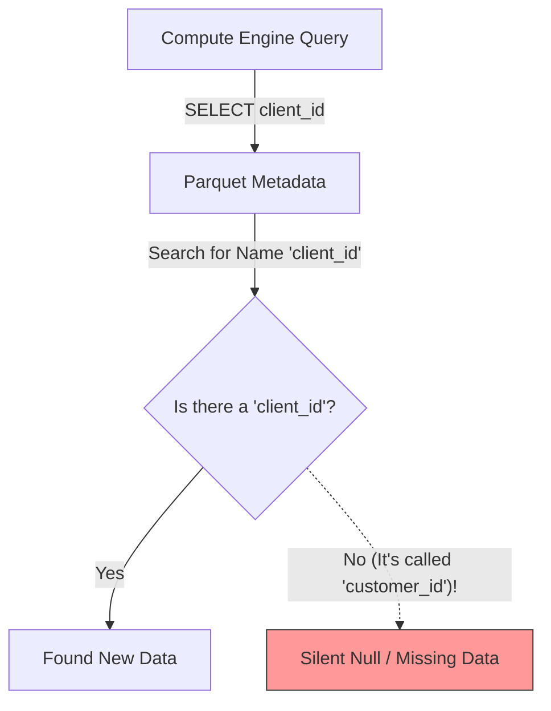
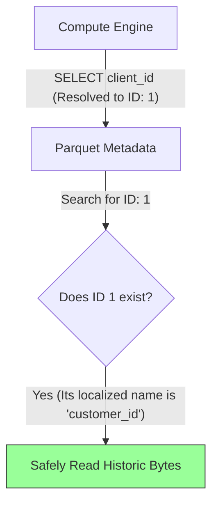
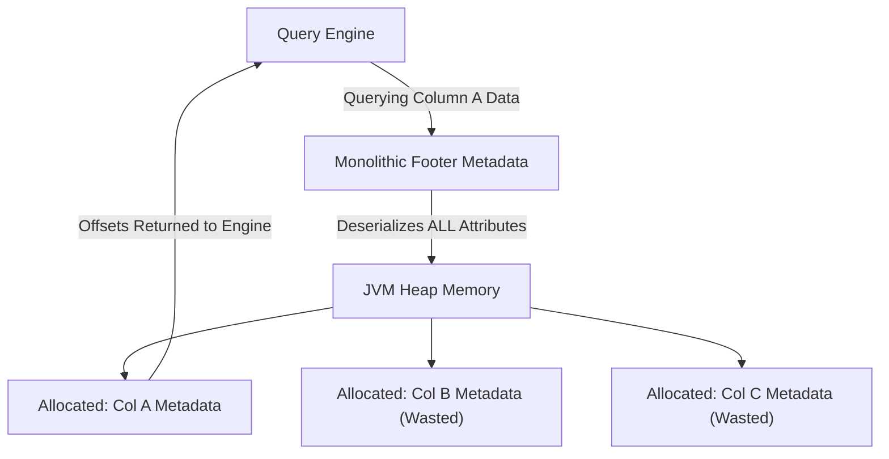
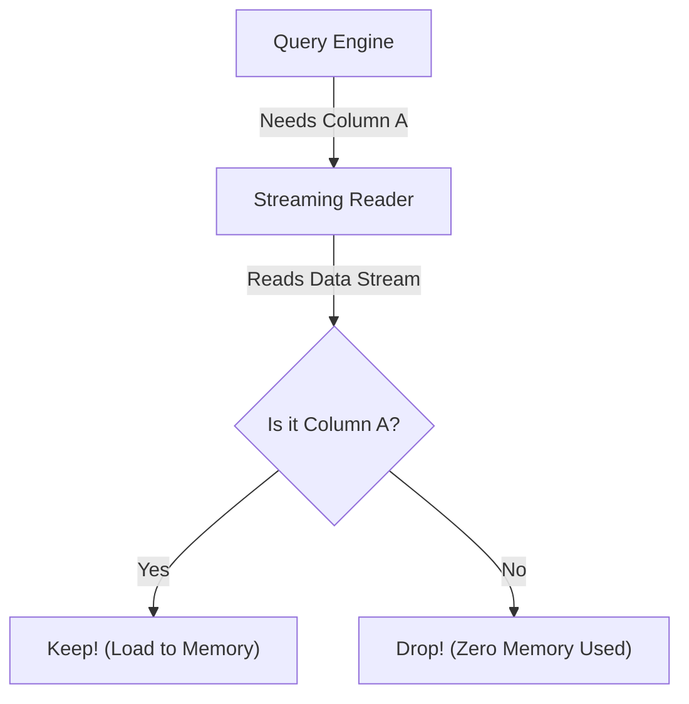
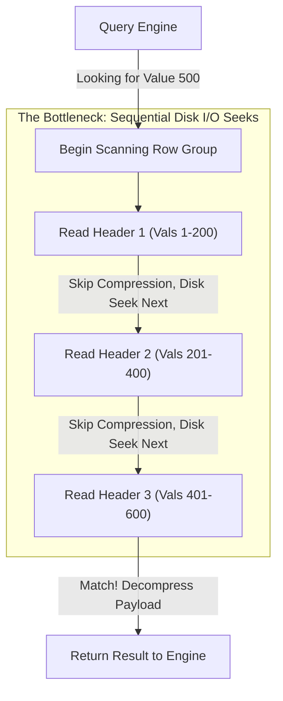
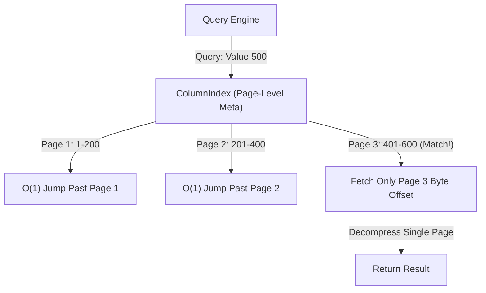
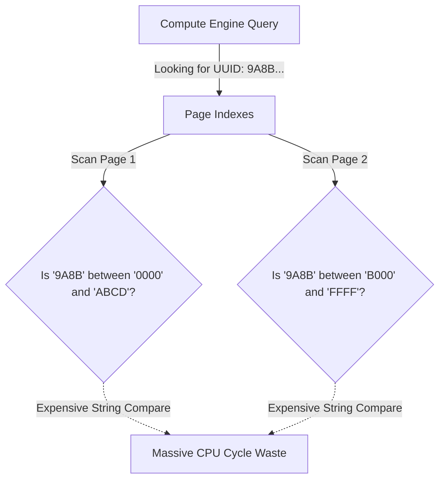
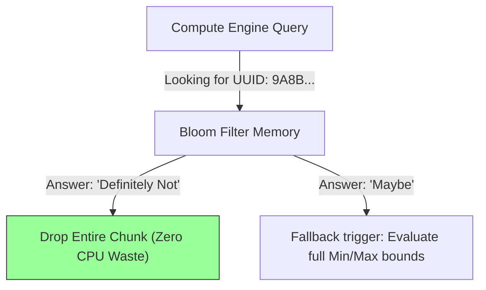
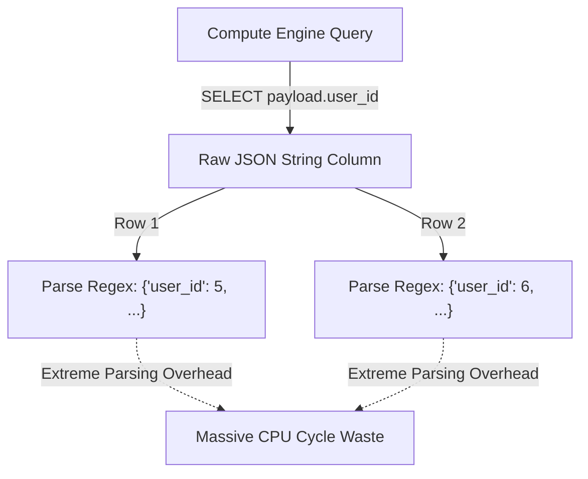
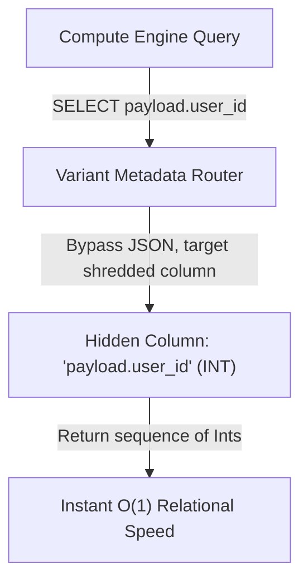

Parquet is no longer just a static file format; it is the universal storage boundary for the entire Big Data ecosystem. Over the last decade, it evolved from a rigid, monolithic data encrypter into a living, index-driven powerhouse. This document tracks what are, in my opinion, 5 important architectural inflection points that evolved Parquet from a simple columnar format into the foundation of modern data lakes.

## 💡 The TL;DR
> **🧠 The Meta Learning:** The evolution of a data format is rarely about finding better ways to compress bytes. Instead, it is a relentless exercise in *pushing complexity upstream*—accepting massive computational penalties during data ingestion to guarantee that downstream analytical queries remain blissfully fast, decoupled, and O(1) scalable.
>
> By fundamentally decoupling logical human-readable concepts from physical byte placement, Parquet ensures that when a massive distributed engine like Apache Spark or Trino queries a dataset, it only ever reads exactly what it absolutely needs.
> 
> **The Mental Anchor:**
> *Think of Parquet not as an Excel spreadsheet on disk, but as a heavily indexed, mathematical database materialized into a single file.*

---

## 🗺️ The Concept Map
Before we look at code or architecture diagrams, here is the structural map of how this format evolved over a decade. We can break it down into 5 distinct architectural milestones:

* **Milestone 1:** Schema Evolution - *Decoupling human-readable names from physical bytes via Field IDs.*
* **Milestone 2:** Event-Driven Thrift Reader - *Inverting the control flow to prevent monolithic metadata memory leaks.*
* **Milestone 3:** Column Indexes - *Extracting page statistics into the Footer to prevent sequential disk I/O.*
* **Milestone 4:** Bloom Filters & Determinism - *Injecting probabilistic hashing algorithms with rigorous cross-language guarantees.*
* **Milestone 5:** Variant Shredding - *Storing NoSQL JSON schemas while executing with rigorous relational integer speed.*

---

### 🏛️ Milestone 1: Schema Evolution via Field IDs (Era: May 27, 2014 | Commit `d456669`)

**The Core Problem:** 
Before this commit, external serialization frameworks (like Thrift and Protobuf) that inherently tracked schema elements using integer tags struggled to perfectly cross-convert into Parquet. Parquet natively bound physical byte chunks tightly to human-readable strings (e.g., `"customer_id"`), destroying the original integer lineage. While string-based mapping was functional, it lacked the strict mathematical immutability required when external systems renamed columns across different framework versions. 

**The Solution:** 
To bridge the gap between serialization frameworks, the format introduced an optional immutable integer: `field_id`. Instead of solely binding data blocks to strings, Parquet began preserving the original integer mappings from the upstream schemas. While originally intended as a simple cross-conversion patch to save the original Thrift tags, preserving this static `field_id` accidentally introduced one of the most powerful architectural patterns in Big Data: decoupling logical names from physical storage.

**Inside the Code: The Abstractions That Shifted**
Looking at the raw commit (`d456669`), we see the surgical addition of an optional integer `field_id` directly affixed to the root `SchemaElement` struct in the global Thrift definitions. While this feels like an incredibly minor code change, this single integer fundamentally shifted Parquet from a brittle historical snapshot format into a living, evolvable file system. 

> [!TIP]
> **The Apache Iceberg Connection**
> This exact integer abstraction is the backbone of Apache Iceberg's "in-place" table evolution. Iceberg maintains a master catalog of your schema heavily indexed by Field IDs. When you run `ALTER TABLE RENAME customer_id TO client_id`, Iceberg simply updates its own catalog to say `"client_id" = ID: 1`. It never touches or rewrites the petabytes of historical Parquet files on disk. When Iceberg queries those old files, it completely ignores the string names in the Parquet headers and strictly binds the data using `Field ID: 1`, guaranteeing perfect continuity without expensive re-computation.

**🎓 Engineering Lesson:** 
**Decouple logical meaning from physical storage.** When building long-term storage systems, never bind human-readable names directly to the physical storage layout. Names change constantly in reaction to shifting business requirements. By inserting an immutable integer abstraction layer between what a column is "called" and where its bytes live, you unlock forward-compatible evolution.

---

### 🏛️ Milestone 2: The Event-Driven Thrift Reader (Era: Aug 29, 2014 | Commit `addbbb9`)

**The Core Problem:** 
Before this commit, Parquet suffered from a "load-the-world" **Metadata** parsing bottleneck. While Parquet's physical *Data* was always columnar and easily skippable, its Footer configuration—which contains the monolithic `FileMetaData` Thrift struct describing all schema layouts, statistics, and byte offsets—was not. When large distributed data engines (like Spark) queried a 5,000-column dataset, they were forced to fully deserialize the metadata objects for all 5,000 columns into JVM heap memory just to find the physical byte offset for a single targeted column. This forced heavy, monolithic JVM allocation, monopolizing Garbage Collection cycles and preventing true O(1) file scans.

**The Solution:** 
The architecture shifted from a "load everything at once" model to a "conveyor-belt" streaming model using the new `EventBasedThriftReader`. 

This completely inverted the control flow:
Previously, the library read all the bytes, built a massive Java object tree, and handed it to the engine. Now, the engine registers `Consumers` (listeners) detailing exactly which fields it cares about *before* parsing starts. The reader then streams through the raw bytes like a conveyor belt. If it sees a field the engine requested, the `Consumer` grabs it. If it sees an unrequested field, it triggers a `SkippingFieldConsumer`, causing the reader to instantly jump past those bytes without ever allocating memory for them.

**The Architectural Tradeoff:** 
Building a "conveyor-belt" parser is much harder to program than a simple "load everything at once" parser. Because the code has to constantly react to data as it streams by piece-by-piece, it requires a messy, complicated web of triggers and nested listeners (classes like `DelegatingListElementsConsumer`) instead of simple, top-to-bottom reading logic. 

The Parquet core team made a deliberate architectural choice here: **they accepted that their own internal codebase would become tangled and difficult to maintain, just so that every external query engine (like Spark) could enjoy massive speed boosts and memory savings.** They absorbed the burden of complexity so the end-user wouldn't have to.

**Inside the Code: The Abstractions That Shifted**
Looking directly at the code changes in the commit, this architectural evolution is anchored by the addition of the `EventBasedThriftReader` class. This specific abstraction is what shifted the core format logic away from a DOM-based paradigm and into a streaming one. 

To make this execution safe and efficient, the team introduced the `SkippingFieldConsumer`—the exact mechanism that allows the consumer engine to completely bypass JVM allocations for fields it does not care about. Finally, to handle complex nested data like arrays without crashing the parser, they introduced the `DelegatingFieldConsumer`, enabling recursive O(1) stream discarding.

**🎓 Engineering Lesson:** 
**Don't force the system to load what it doesn't need.** When designing a tool that processes massive amounts of data, avoid the urge to pull everything into memory just to find one piece of information. Instead, invert the control: let external callers "subscribe" to the exact fields they care about as the data streams by. You might make your own internal code messier to maintain, but you will save your users enormous amounts of memory and CPU time.

---

### 🏛️ Milestone 3: Column Indexes & Page Skipping (Era: Oct 16, 2017 | Commit `f1de77d`)

> [!NOTE] 
> **Context: What is a Data Page?** 
> In Parquet, a file is sliced into massive horizontal **Row Groups** (~128MB). Each Row Group contains **Column Chunks** (the data for a specific column). Each chunk is further divided into **Data Pages** (~1MB). 
> 
> A Data Page is the *smallest indivisible unit* of physical compression. You cannot read a single byte or value; if you need data from a page, you must load and decompress the entire 1MB block.

**The Core Problem:** 
Parquet actually *always* recorded min/max statistics for individual data pages. However, it suffered from a profound data-locality bottleneck: those page statistics were physically embedded directly inside each `DataPageHeader`. This meant the statistics were interleaved with the massive compressed byte streams on disk. While an engine didn't have to fully decompress a mismatched page, it still had to perform agonizing sequential I/O disk seeks to read the header just to find out if it could skip the rest of the block. You couldn't skip a page without reading its header first.

**The Solution:** 
To solve this, the architecture introduced standalone page-level index structures (`ColumnIndex` and `OffsetIndex`). The Parquet core physically *extracted* all those interleaved min/max statistics out of the data pages and consolidated them directly into the file's Footer. 

**The Architectural Tradeoff:** 
This introduced a severe metadata footprint penalty in the file footer. The Parquet format forcibly centralized massive amounts of granular statistics, inflating the size of the footer block significantly. However, this trade-off unlocked true O(1) page skipping natively within the file format. Read-heavy engines could now load the consolidated `ColumnIndex` in a single network fetch and calculate the exact binary byte boundaries of the relevant pages, jumping instantly across the disk without ever doing sequential I/O header hops.

**Inside the Code: The Abstractions That Shifted**
If you look at the raw commit (`f1de77d`), developers added two primary new structures to the core spec: `OffsetIndex` and `ColumnIndex`. Inside `ColumnIndex`, they nested `min_values`, `max_values` and `null_pages` arrays which map perfectly 1:1 to the pages in a column chunk. To route the engine, they introduced the `PageLocation` struct, giving the reader the exact byte offset to jump to.

**🎓 Engineering Lesson:** 
**Read-optimized formats trade write-time complexity for read speed.** If you are building a system (like a data lake) that is read 1,000 times more often than it is written, you should push heavy computational burdens onto the write phase. Yes, indexing every single page makes the writer slower, but it deliberately sacrifices write performance to guarantee instantaneous, O(1) reads for millions of downstream queries at scale.

---

### 🏛️ Milestone 4: Bloom Filters & Cross-Ecosystem Determinism (Commits `54839ad`, `9bdd844`)

**The Core Problem:** 
Even after adding O(1) Page Indexes in 2017 (Milestone 3), searching for highly unique strings—like a specific User UUID—remained painfully slow. To find a single needle in a haystack, the engine still had to sequentially evaluate thousands of `min_values` and `max_values` metadata boundaries. Because comparing textual strings byte-by-byte is computationally expensive relative to comparing integers, forcing the query engine to precisely evaluate millions of string bounds created a massive CPU bottleneck before a single byte of physical data was even loaded.

**The Solution:** 
To bypass sequential exact-value checks, Parquet (in commit `54839ad`) introduced probabilistic **Bloom Filters** explicitly packed alongside the chunk metadata. A Bloom Filter is a highly compact bit-array that sacrifices absolute accuracy for blistering lookup speed. When an engine searches for a UUID, it mathematically hashes the UUID and instantly checks the tiny bit-array. The filter answers with either *"Definitely Not Here"* (instantly dropping the chunk) or *"Maybe Here"* (triggering a fallback evaluation).

**Inside the Code: The Determinism Patch**
While introducing `BloomFilterHeader` was a massive achievement, the true architectural triumph came slightly later in the "Determinism Patch" (Commit `9bdd844`). Initially, the format told writers and readers to simply use "xxHash" to construct the filters. However, because xxHash has different behaviors depending on the CPU architecture (XXH32, XXH64) and random seeds, a Bloom Filter generated by a Java writer was mathematically failing when evaluated by a Rust or C++ engine because they defaulted to different hash variations. Commit `9bdd844` painstakingly locked down the specification to strictly mandate `XXH64 with a seed of 0`, guaranteeing absolute cross-ecosystem determinism.

**The Architectural Tradeoff:**
Bloom Filters are not free; they trade CPU efficiency for raw storage bloat. Because these bit-arrays are packed into the file format, engineers must strictly tune the `bloom_filter_ndv` (Number of Distinct Values) constraint. If you allocate too many bits trying to achieve perfect accuracy, your Parquet metadata inflates so severely that the file footer becomes slower to download than the actual data.

**🎓 Engineering Lesson:** 
**Embrace probabilistic structures, but lock down the math.** When you hit a hard CPU ceiling iterating through deterministic arrays, bypass the bottleneck by implementing probabilistic filters. However, if your data format must be read across different programming languages and CPU architectures, you cannot rely on default vendor hash algorithms. You must rigorously codify the specific hash variant and seed values into your spec, otherwise your probabilistic structures will silently corrupt across boundaries.

------

### 🏛️ Milestone 5: Variant Shredding & Semi-Structured Evolution (Era: 2024–2025 | Commits `dff0b3e`, `37b6e8b`)

**The Core Problem:** 
By 2024, data ecosystems had shifted heavily toward dynamic, semi-structured data (JSON, BSON). Parquet, however, is rigidly static. Because JSON structures change shape constantly, Data Engineers got tired of breaking their pipelines. They resorted to bypassing the schema entirely, dumping entire raw JSON payloads into a single, generic Parquet `String` column. 

While this technically fixed the schema problem, it completely neutralized the primary reasons to use Parquet in the first place:
1. **Loss of Columnar I/O:** Parquet's main performance advantage is "projection pushdown"—if you query 1 column out of 100, the engine only reads 1% of the file from disk. But if 100 nested attributes are stuffed into a single massive JSON string column, the engine is forced to read the entire bloated column into memory anyway, destroying I/O performance.
2. **Loss of Native Math & Compression:** Storing an integer (like `200`) as a string (`"200"`) inside a JSON block means Parquet cannot use specialized integer compression (like Bit-Packing). Furthermore, to evaluate a query like `SELECT payload.status`, the compute engine must boot up a heavy JSON parser at runtime to count brackets, extract the text, and cast it back to an integer for every single row.

**The Solution:** 
The community introduced the `VARIANT` type paired with a revolutionary physical mechanism called **Shredding**. Shredding acts like real-time schema inference during the write phase. When Parquet writes a JSON stream, if it notices that `payload.user_id` appears frequently as an integer, it "shreds" that nested field completely out of the JSON blob. It transparently creates a dedicated, hidden, strongly-typed physical column specifically for `payload.user_id` inside the file structure.

> [!TIP]
> **Handling Data Polymorphism**
> What if the underlying type changes? If a `status` field is an integer `200` in Row 1, but a string `"OK"` in Row 2, the engine handles this by shredding the field into *multiple parallel* typed sub-columns (e.g., `status.typed_value.int` and `status.typed_value.string`). Row 1 writes `200` to the int column and `null` to the string column. Row 2 writes `null` to the int column and `"OK"` to the string column. Because Parquet compresses nulls to practically zero bytes, it safely supports dynamic polymorphism without inflating the file size or crashing the reader!

When a modern engine queries that JSON path, Parquet routes the query entirely bypassing the heavy JSON string blocks, pulling directly from the hidden columnar integers. 

**The Architectural Tradeoff:**
While significantly faster than raw Regex parsing, this is **not** true native relational speed. The compute engine must read the parallel sub-columns from disk, execute null-checks across them, and zip the memory vectors back together in CPU to reconstruct the original polymorphic object. You pay a constant, underlying CPU tax at read-time in order to maintain NoSQL developer flexibility at write-time.

**Inside the Code: The Abstractions That Shifted**
Looking at the final commits (`dff0b3e`, `37b6e8b`), the architecture reveals a complex two-pronged attack. First, they introduced `VARIANT` as a high-level `LogicalType`. However, because Shredding physically reorganizes the exact byte layout, they had to introduce new structural annotations for `value` and `typed_value` metadata streams. It represents the most complex bridging of Logical structure and Physical byte placement since the format was conceived in 2013.

**🎓 Engineering Lesson:** 
**Bridge paradigms by shredding to the lowest common denominator.** When building systems that must bridge conflicting worlds (e.g., NoSQL flexibility vs. Relational analytical speed), do not try to emulate one within the other at query time. Instead, design a transparent ingestion mechanism that "shreds" the flexible data down into rigid, high-performance physical structures natively beneath the hood. Give your users the API of MongoDB, but execute with the physical layout of PostgreSQL.

---

## 🏁 Conclusion: The Ultimate Parquet Tradeoff
If you look across all 5 of these milestones—from indexing every single data page to mathematically shredding JSON on the fly—a single unifying architectural philosophy emerges: **Punish the writer to bless the reader.**

Parquet evolved into the bedrock of the modern data stack because it accepts extreme computational complexity during the data ingestion phase. It forces the writer to calculate statistics, build Bloom Filters, maintain dictionary hash-maps, and dynamically shred schemas so that the read-path can remain blissfully fast and achieves O(1) skipping capability.

There are no silver bullets in system design; we pay a heavy CPU tax up-front to guarantee scalable analytics downstream.

---

*The content for this blog was created with the assistance of an LLM.*
